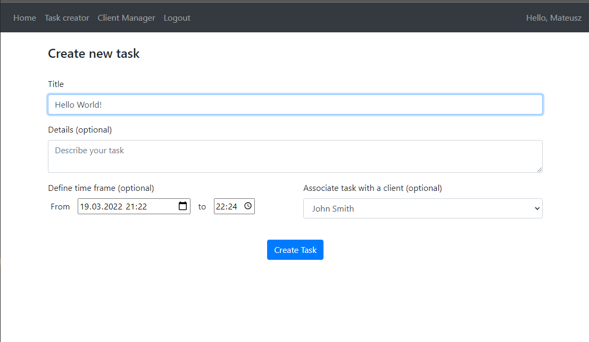

_(project in progress)_
# TimeSheet
This is my first Flask project, advanced todo-list with extra features. I hope you enjoy!  

## Technologies used
- Python
- Flask
- Jinja
- HTML
- Bootstrap
- JS
- CSS

## Features implemented
- Login/Registe:
  - Password hashing
  - Login required
- Authentication:
  - User Greeting
  - Dynamic NavBar
- Create Clients
- Create Tasks:
  - User owns task
  - Each task can be linked to a Client
  - Full info display
- SQL Database:
  - User (email, password, name)
  - Client (phone, name)
  - Task (title, details, time_start, time_end, time_created)
    - FK::user.id
    - FK::client.id

## Todo
- actual time sheet of tasks (weekly)
- extend client manager
- ...
